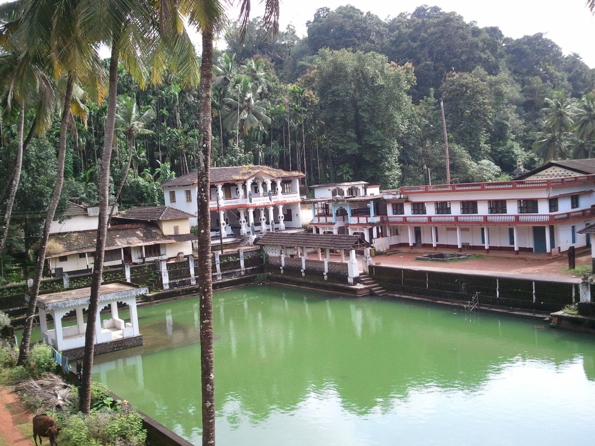
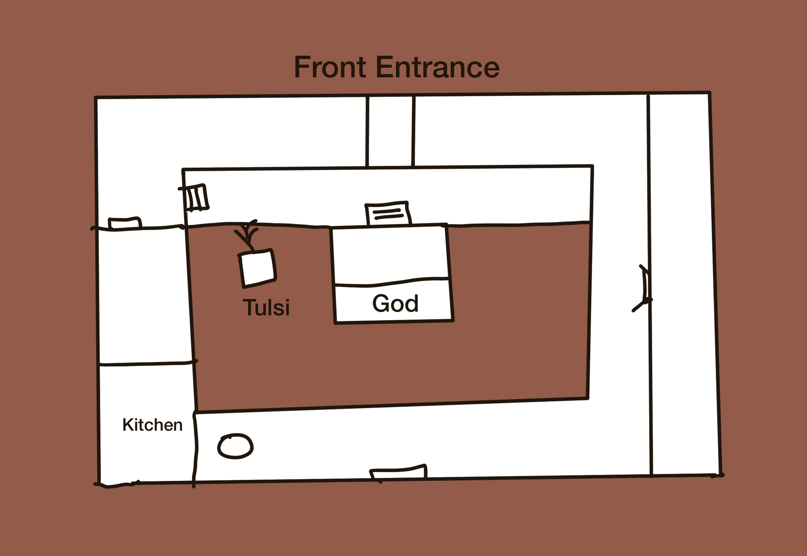
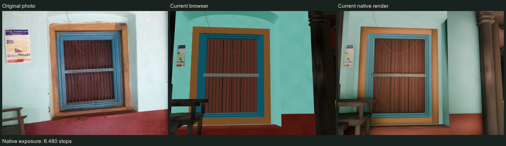
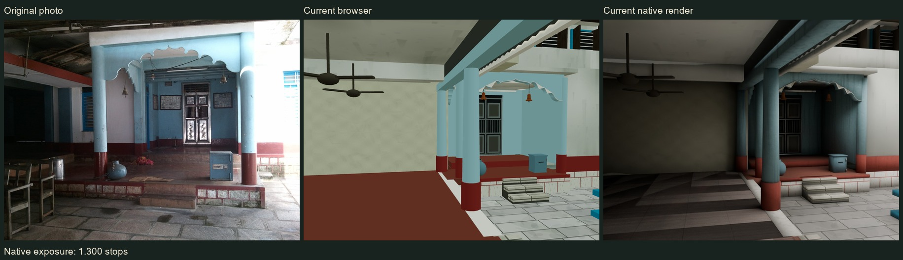

## Background
My grandparents' house in the village of Shankaranarayana was demolished a decade ago. The neighborhood was beautiful with a large lake at the center, and a temple next to it. They contained precious memories from my childhood. In 2011, I was aware that the house might be torn down as it was too old, so I took plenty of photos in and around the house, including the temple next door. 

*The neighborhood around the lake, photographed in September 2011.*

Now with the advent of powerful coding agents like GPT-6 and Opus 5.5 and people showing off their 3D modelling capabilities, I thought let me see if I can re-create my childhood places from photos in 3D. 

## Process
I started out by drawing a rough floormap of the house using Procreate on my iPad. I downloaded all the important photos, about 100 of them in a separate directory. 

*My rough ground-floor plan, drawn from memory—the starting point for the house.*

I started a session and set a goal to create the 3D version and keep improving the fidelity. 
It ran overnight and created a pretty decent first version. 

### Alignment
After the initial version, I corrected it several times by describing the changes.
Initially I renamed many of the photos by hand, describing the rough location and angle as file names.
Later I created an align tool that lets me place the photo in the 3D world itself, making the process much easier. 
The alignment tool records the exact position and angle with reference to the 3D model while displaying the photograph. 

*Left to right: the original photograph, browser reconstruction and Blender render. Matching the viewpoint makes differences in the window frame, proportions and lighting easier to spot.*

### Light and heavy versions 
Initially I created the webapp with the goal to make it easy to view for anyone.
Later I created a more photo realistic desktop version by using Blender and Unreal. 
These re-use the same 3D model, but add details like meshes, texture, lighting etc. 
I added gamepad support to make it easy to navigate. Now I can play this like a game. 

*The blue temple porch: original photograph, browser reconstruction and Blender render. These saved development snapshots show the effect of materials and lighting; some shapes and details still differ from the photographs.*

## Release
I used the ChatGPT Sites to deploy it as a [Webapp](https://shankaranarayana.abhishekraok.chatgpt.site/) so that my relatives can experience it easily on their phones. I have shared the source code on [Github](https://github.com/abhishekraok/shankaranarayana-house) and the photos without people(CC BY 4). Feel free to re-create your own child places and re-live in them.

I feel like the characters in Permutation City who live in a virtual world from their memory. 